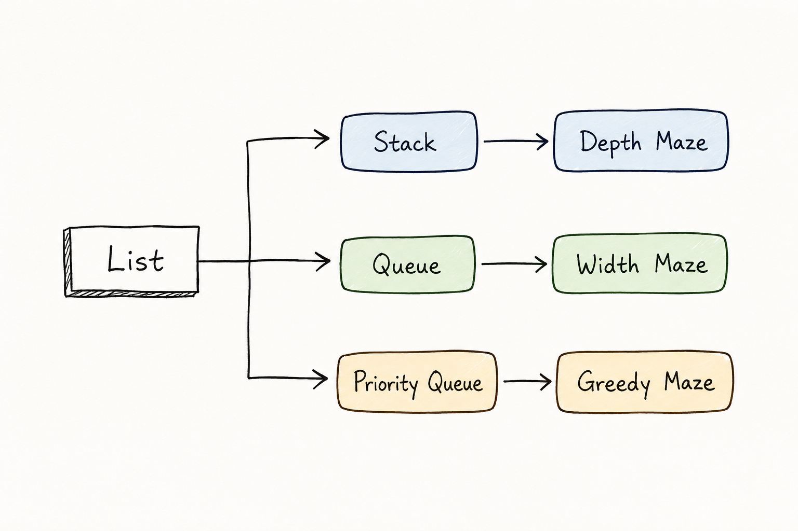

## Structure

List
├─ Stack → Depth Maze  
&nbsp;&nbsp;&nbsp;&nbsp;&nbsp;&nbsp;├─ Queue → Width Maze  
&nbsp;&nbsp;&nbsp;&nbsp;&nbsp;&nbsp;└─ Priority Queue → Greedy Maze

상속 구조를 이용하여 미로 탐색 코드를 구현하였다.
